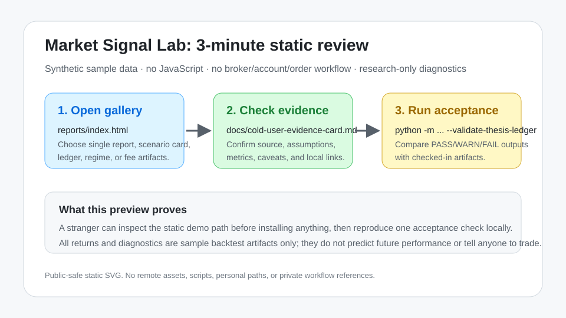

# Quick-Tour Preview

This page is the shortest visual route for a cold reviewer who wants to understand Market Signal Lab before installing anything.



## Three-minute route

1. Open the [static sample gallery](../reports/index.html).
2. Read the [cold user evidence card](cold-user-evidence-card.md) for source, assumptions, outputs, and caveats.
3. Run the local acceptance check:

```bash
python -m market_signal_lab.cli --validate-thesis-ledger
```

4. Compare the generated acceptance output with [the checked-in acceptance summary](../reports/cross-asset-thesis-ledger-acceptance.md).

## Boundary

This preview is a static documentation artifact. It uses no JavaScript, no remote assets, no live data, no broker or account workflow, no orders, no position sizing, no forecasts, no recommendations, and no investment advice. The sample returns and metrics are historical diagnostics from synthetic/static fixtures only; they are not a guarantee of future returns.
